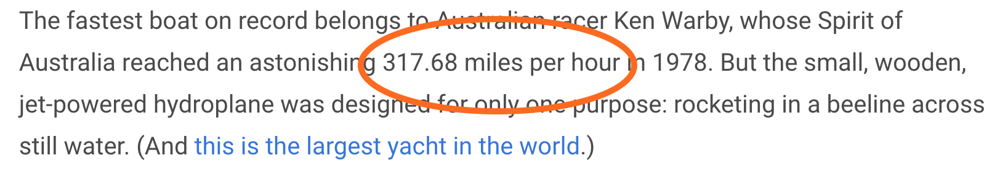
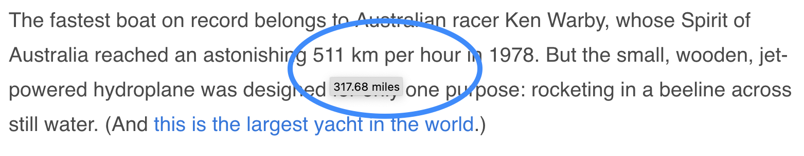

# Eurofox 🇪🇺 🔥 🦊

Firefox plugin to automatically translate ° Fahrenheit and size measurements into european units.
To see the original value, hover over the measurement.

Before:

After:

The numbers are rounded for easier reading, so don't expect exact values.
The plugin will not work (yet) for values which are spelled out as words instead of numbers (such as `one mile` instead of `1 mile`).

To check if the installation works in your browser, please navigate to the [test page](demo/test.html).

## Supported units:

* Temperature (Fahrenheit to Celsius)
* Sizes (inch, foot, yard, miles)
* Areas (acres)
* Speeds (mph, knots)
* Liquids (barrel, gallon)

## TODOs

* BUG: broken test for inches (see regex101 link)
* BUG: exclusion of style tags doesn't work anymore
* WIP: DOM mutation observer - how to avoid endless recursion?
* BUG: multiple edge cases on the test page
* add missing unit tests for yard, miles, acres and edge cases from test page
* github protect main branch
* convert units for cooking (pint, cup, quart, various spoons and ounces)
* remove redundancies in function definitions
* maybe replace jquery with pure js
* make ESLint more strict
* remove console output
* explain demo page and add screenshots of expected outcomes
* maybe ignore invisible nodes (css display/visibility)
* add integration tests
* add options to exclude domains
* maybe support spelled out numbers, like `nine inch nails` in addition to `9 inch nails`
* add config option for css for the replacement span, such as background colour
* add button to activate / deactivate in toolbar
* test in chrome
* publish

## Notes for development

* Regexes:
    - temperature in [ecma](https://regex101.com/r/Wrpp4x/2) and the original in [pcre](https://regex101.com/r/Ak5Joj/1)
    - inches https://regex101.com/r/WO25Zd/2
    - feet https://regex101.com/r/xVnj9A/3
    - miles https://regex101.com/r/qAti0n/2
    - mph https://regex101.com/r/8AvYcc/1
* for converting regexes from pcre 🧠 => ecma:
	`npm install regex-translator; npx regex-translator -o -T ecma -F pcre -R "(° ?)?\d+(\.\d+)?+°?+ ?[fF]"`
* more units up for convertion at
    - [wiki/United_States_customary_units](https://simple.wikipedia.org/wiki/United_States_customary_units)
    - [wiki/Category:Imperial_units](https://en.wikipedia.org/wiki/Category:Imperial_units)
* run `npm test` for unit tests.
* fun fact: I'm not a frontend dev, I don't really know what I'm doing. Apologies.
* the source was, at one point, inspired by the [tc](https://github.com/spb/tc) firefox extension.

