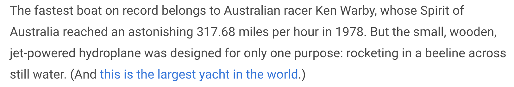
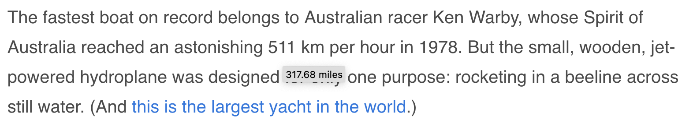

# Eurofox 🇪🇺 🔥 🦊

Firefox plugin to automatically translate ° Fahrenheit and size measurements into european units.
To see the original value, hover over the measurement.

Before:

After:

The numbers are rounded for easier reading, so don't expect exact values.
The plugin will not work for values which are spelled out as words instead of numbers (such as `one mile` instead of `1 mile`).

The source is inspired by the [tc](https://github.com/spb/tc) firefox extension.

To check if the installation works in your browser, please navigate to the [test page](demo/test.html).

## Supported units:

* Temperature (Fahrenheit to Celsius)
* Sizes (inch, foot, yard, miles)
* Areas (acres)
* Speeds (mph, knots)
* Liquids (barrel, gallon)

## TODOs

* WIP DOM mutation observer
* BUG: multiple edge cases on the test page
* replace numbers like `3.0` with `3` and remove all `.0` from tests
* add missing unit tests
* add github actions for unit tests and protect main branch
* convert units for cooking (pint, cup, quart, various spoons and ounces)
* maybe replace jquery with pure js
* make logo?
* make ESLint more strict
* remove console output
* turn into JS module
* clean up screenshots and highlight translation
* publish
* add options to exclude domains

## Notes for development

* Regexes:
    - temperature in [ecma](https://regex101.com/r/Wrpp4x/2) and the original in [pcre](https://regex101.com/r/Ak5Joj/1)
    - inches https://regex101.com/r/92Bl59/2
    - feet https://regex101.com/r/xVnj9A/3
    - miles https://regex101.com/r/qAti0n/2
    - mph https://regex101.com/r/8AvYcc/1
* for converting regexes from pcre 🧠 => ecma:
	`npm install regex-translator; npx regex-translator -o -T ecma -F pcre -R "(° ?)?\d+(\.\d+)?+°?+ ?[fF]"`
* more units up for convertion at
    - [wiki/United_States_customary_units](https://simple.wikipedia.org/wiki/United_States_customary_units)
    - [wiki/Category:Imperial_units](https://en.wikipedia.org/wiki/Category:Imperial_units)
* run `npm test` for unit test fun.
* fun fact: I'm not a frontend dev, I don't really know what I'm doing. Apologies.

